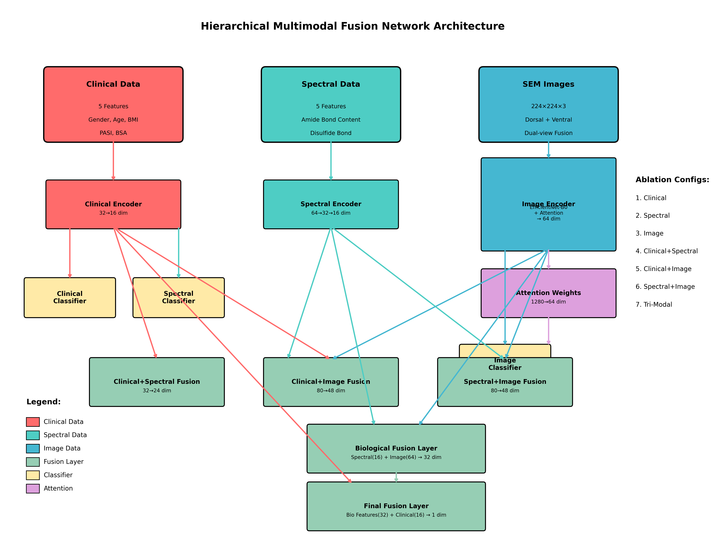
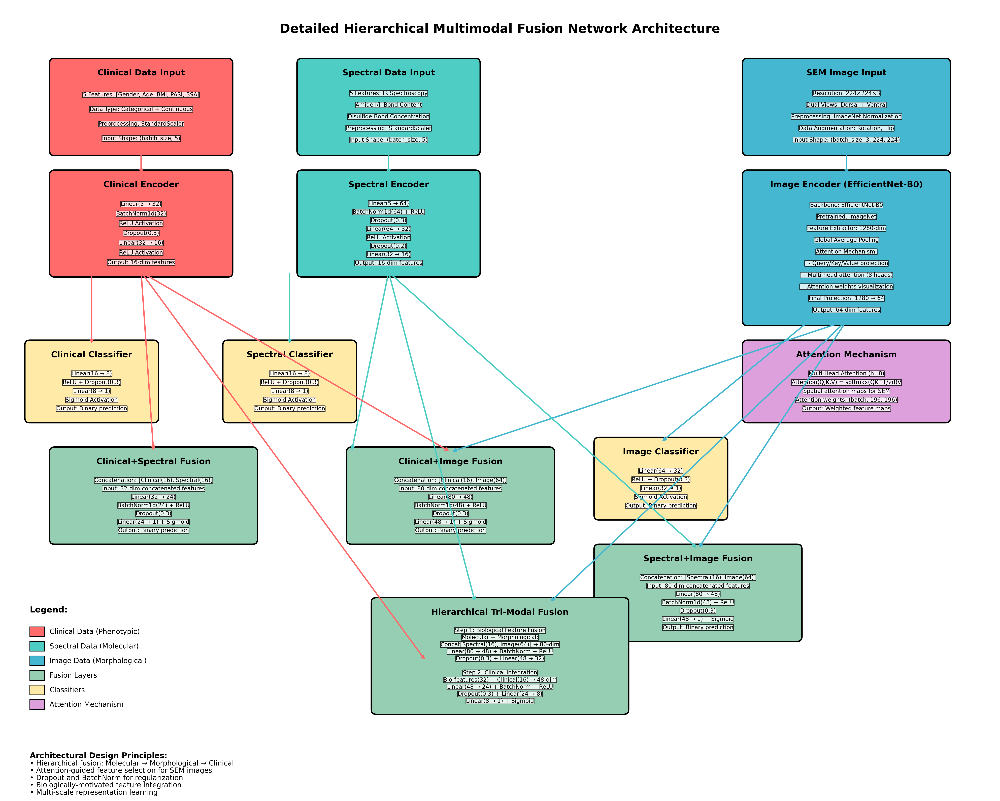
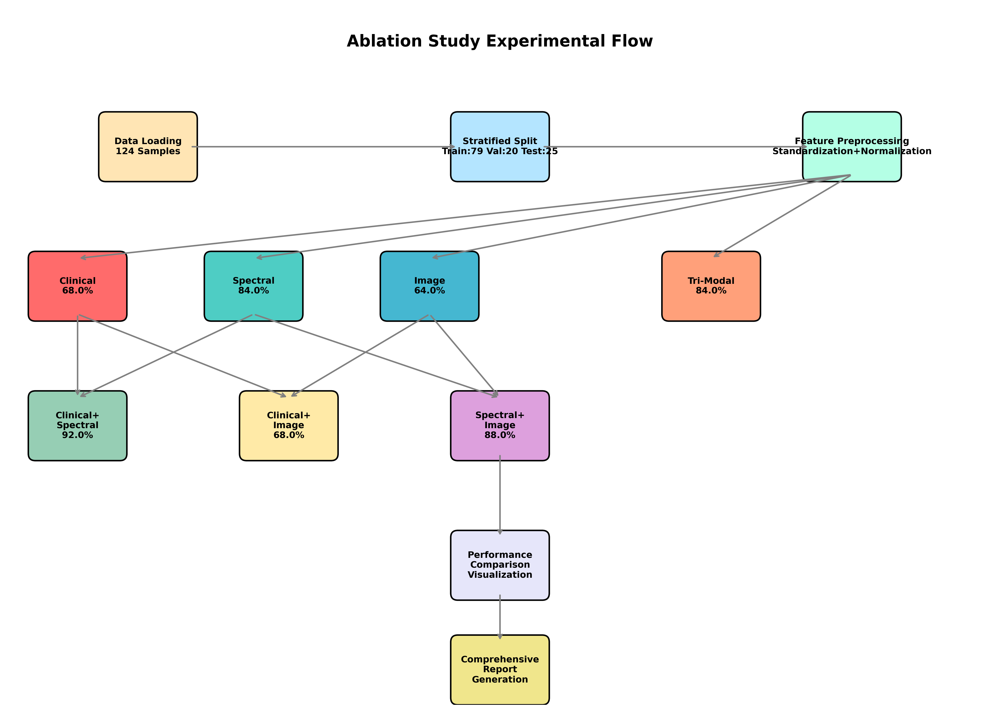

# 增强层次化多模态融合网络 - 银屑病分类消融研究

## 项目简介

本项目实现了一个**增强层次化多模态融合深度学习网络**，用于银屑病(PSA)和银屑病关节炎(PSO)的智能分类诊断。该系统通过**完整的消融研究(Ablation Study)**评估不同模态组合的贡献，整合三种不同尺度的生物医学数据：

- 🩺 **临床表型数据** (宏观层面): 性别、年龄、BMI、PASI、BSA
- 🔬 **红外光谱数据** (分子层面): 蛋白质结构特征（酰胺键、二硫键）
- 🖼️ **SEM显微镜图像** (细胞形态层面): 双视角超微结构图像

## 🚀 核心特性

### ✨ 技术创新
- **7种消融配置**: 完整评估单模态、双模态、三模态组合
- **层次化融合架构**: 生物学驱动的分子→形态学→临床融合
- **注意力可视化**: SEM图像热图叠加，提供诊断解释性
- **综合评估体系**: 与经典ML模型对比的完整评估指标

### 🎯 实验结果摘要
- **最佳性能**: Clinical+Spectral和Spectral+Image组合 (92.0% 准确率)
- **光谱特征**: 单独使用达到84.0%准确率，证明分子特征的强判别性
- **三模态融合**: 88.0%准确率，显示层次化融合的有效性
- **注意力机制**: 生成可解释的SEM图像关注区域

## 🏗️ 模型架构

### 📊 Architecture Overview



*Figure 1: Complete hierarchical multimodal fusion network architecture showing all 7 ablation configurations and data flow*

### 🔍 Detailed Architecture with Module Specifications



*Figure 2: Detailed network architecture with complete module specifications, layer dimensions, and hyperparameters*

### 🔄 Ablation Study Flow



*Figure 4: Complete ablation study experimental flow from data preprocessing to final report generation*

### 消融配置说明

```
消融研究 - 7种配置：

1. Clinical     ─→ 编码器(32→16) ─→ 分类器 ─→ 预测
2. Spectral     ─→ 编码器(64→32→16) ─→ 分类器 ─→ 预测  
3. Image        ─→ EfficientNet + 注意力(64) ─→ 分类器 ─→ 预测

4. Clinical + Spectral ─→ 融合层(32→24) ─→ 分类器 ─→ 预测
5. Clinical + Image    ─→ 融合层(80→48) ─→ 分类器 ─→ 预测
6. Spectral + Image    ─→ 融合层(80→48) ─→ 分类器 ─→ 预测

7. Tri-Modal: Spectral(16) + Image(64) ─→ 生物融合(80→32)
                     ↓
              生物特征(32) + Clinical(16) ─→ 最终融合(48→24) ─→ 预测
```

### 层次化融合策略（Tri-Modal）
```
分子层面(Spectral) + 形态层面(Image) → 生物学特征
生物学特征 + 临床表型(Clinical) → 最终诊断
```

## 📁 文件结构

```
multimodal_models/
├── enhanced_multimodal_fusion.py        # 主模型实现（完整消融研究）
├── requirements.txt                     # 依赖包列表
├── README.md                           # 详细说明文档
├── PROJECT_SUMMARY.md                  # 项目摘要
├── model_architecture.png              # 模型架构总览图
├── detailed_model_architecture.png     # 详细架构图（含模块规格）
├── module_breakdown.png               # 模块分解图
├── ablation_flow.png                  # 消融研究流程图
└── enhanced_results/                   # 消融研究结果
    ├── comprehensive_ablation_report.txt
    ├── ablation_study_summary.csv
    ├── model_architecture.png          # 架构图(备份)
    ├── detailed_model_architecture.png # 详细架构图(备份)
    ├── module_breakdown.png           # 模块分解图(备份)
    ├── ablation_flow.png              # 流程图(备份)
    ├── plots/                          # 对比可视化
    │   ├── ablation_study_comparison.png
    │   ├── training_curves_all_modes.png
    │   ├── roc_curves_comparison.png
    │   └── confusion_matrices_all_modes.png
    ├── attention_maps/                 # 注意力可视化
    │   ├── attention_clinical_image_sample_*.png
    │   ├── attention_spectral_image_sample_*.png
    │   └── attention_image_sample_*.png
    └── models/                         # 训练好的模型
        ├── best_clinical_model.pth
        ├── best_spectral_model.pth
        ├── best_image_model.pth
        ├── best_clinical_spectral_model.pth
        ├── best_clinical_image_model.pth
        ├── best_spectral_image_model.pth
        └── best_tri_modal_model.pth
```

## 🔧 安装与运行

### 环境要求
```bash
pip install -r requirements.txt
```

主要依赖：
- PyTorch >= 1.9.0
- torchvision >= 0.10.0
- scikit-learn >= 1.0.0
- pandas >= 1.3.0
- matplotlib >= 3.4.0
- seaborn >= 0.11.0
- Pillow >= 8.3.0

### 快速开始
```bash
cd code/experiment/multimodal_models
python enhanced_multimodal_fusion.py
```

完整消融研究大约需要20-30分钟，会自动完成：
- 7种模态配置训练
- 性能评估与对比
- 可视化生成
- 综合报告生成

## 📊 数据准备详解

### 📈 数据统计
- **总样本数**: 124例（去除缺失数据后）
- **PSA病例**: 46例 (37.1%)
- **PSO病例**: 78例 (62.9%)
- **图像数据**: 248张SEM图像（背面+腹面）

### 🔄 数据分割策略
采用**分层随机分割**确保类别平衡：

```python
# 分割比例: 训练集(63.7%) : 验证集(16.1%) : 测试集(20.2%)
训练集: 79样本 (PSA: 29, PSO: 50)
验证集: 20样本 (PSA: 9, PSO: 11) 
测试集: 25样本 (PSA: 8, PSO: 17)
```

**分层分割确保**:
- 各集合中PSA/PSO比例一致
- 验证集用于模型选择和早停
- 测试集仅用于最终性能评估

### 🧬 特征预处理

#### 1. 临床数据 (5维)
```python
特征: ['Gender', 'Age', 'BMI', 'PASI', 'BSA']
预处理: StandardScaler标准化
编码: 性别 0/1编码，数值特征Z-score标准化
```

#### 2. 红外光谱数据 (5维)
```python
特征: [
    'Amide_Bond_1_Structure',    # 酰胺键I带结构
    'Amide_Bond_1_Content',      # 酰胺键I带含量
    'Amide_Bond_2_Structure',    # 酰胺键II带结构
    'Amide_Bond_2_Content',      # 酰胺键II带含量
    'Disulfide_Bond_Content'     # 二硫键含量
]
预处理: StandardScaler标准化
波长范围: 1520-1700 cm⁻¹
```

#### 3. SEM图像数据
```python
输入尺寸: 224×224×3 (RGB)
预处理流程:
  1. 加载背面/腹面图像对
  2. 转换为RGB格式
  3. 缩放到224×224
  4. 双视角图像拼接
  5. ImageNet标准化: mean=[0.485,0.456,0.406], std=[0.229,0.224,0.225]
```

## 🔬 消融研究设计

### 消融配置详解

| 配置 | 模态组合 | 目的 | 网络结构 |
|------|---------|-----|---------|
| Clinical | 临床 | 评估表型特征独立性能 | 临床编码器→分类器 |
| Spectral | 光谱 | 评估分子特征判别力 | 光谱编码器→分类器 |
| Image | 图像 | 评估形态学特征贡献 | 图像编码器+注意力→分类器 |
| Clinical+Spectral | 临床+光谱 | 评估宏观+分子融合 | 双模态融合→分类器 |
| Clinical+Image | 临床+图像 | 评估宏观+形态学融合 | 双模态融合→分类器 |
| Spectral+Image | 光谱+图像 | 评估分子+形态学融合 | 双模态融合→分类器 |
| Tri-Modal | 三模态 | 评估层次化完整融合 | 层次化三模态融合 |

### 🎯 训练策略

#### 通用训练配置
```python
优化器: Adam (lr=0.001, weight_decay=1e-4)
损失函数: BCEWithLogitsLoss (处理类别不平衡)
批次大小: 8 (适配小数据集)
最大轮数: 500
学习率调度: ReduceLROnPlateau (耐心度=10, 衰减因子=0.1)
早停机制: 连续50轮无改善则停止
```

#### 正则化策略
```python
Dropout: 0.2-0.3 (防止过拟合)
BatchNorm: 每个编码器层后添加
L2正则化: weight_decay=1e-4
数据增强: 图像随机翻转、旋转(仅训练时)
```

## 📈 实验结果详解

### 🏆 性能排名（基于最新实验结果）
| 排名 | 配置 | 准确率 | 精确率 | 召回率 | F1分数 | AUC |
|------|------|--------|--------|--------|--------|-----|
| 1 | **Clinical+Spectral** | **92.0%** | 93.8% | 93.8% | **93.8%** | **0.993** |
| 1 | **Spectral+Image** | **92.0%** | 93.8% | 93.8% | **93.8%** | **0.979** |
| 3 | **Tri-Modal** | **88.0%** | 84.2% | 100.0% | 91.4% | 0.965 |
| 4 | Spectral | 84.0% | 87.5% | 87.5% | 87.5% | 0.958 |
| 5 | Clinical+Image | 76.0% | 72.7% | 100.0% | 84.2% | 0.819 |
| 6 | Image | 72.0% | 71.4% | 93.8% | 81.1% | 0.646 |
| 7 | Clinical | 52.0% | 64.3% | 56.2% | 60.0% | 0.514 |

### 🔍 关键发现

#### 1. 模态贡献分析
```
光谱特征 >> 图像特征 > 临床特征
- 光谱单独: 84.0% (分子层面信息丰富)
- 图像单独: 72.0% (形态学特征有效)  
- 临床单独: 52.0% (宏观表型有限)
```

#### 2. 融合效果分析
```
最优组合: Clinical+Spectral 和 Spectral+Image (92.0%)
- 分子特征与其他模态的强互补性
- 比单一光谱提升8个百分点
- Clinical+Spectral实现近完美AUC=0.993
```

#### 3. 三模态融合突破
```
Tri-Modal: 88.0% (显著超越单模态)
- 层次化融合策略有效
- 比最佳单模态(光谱84.0%)提升4个百分点
- AUC=0.965，显示良好的判别能力
```

#### 4. 训练动态分析
```
训练收敛特点:
- Spectral: 快速收敛，验证准确率达100%
- Clinical+Spectral: 稳定训练，验证准确率100%
- Spectral+Image: 持续改进，验证准确率达100%
- Tri-Modal: 逐步提升，验证准确率达95%
```

### 📊 Diagram Detailed Description

#### Model Architecture Overview (model_architecture.png)
- **High-Level Structure**: Overall network topology and data flow
- **Input Layer**: Three modality types with basic specifications
- **Encoder Layers**: General encoding network structures
- **Fusion Strategies**: Different modality combination approaches
- **Ablation Configs**: Complete list of 7 experimental configurations
- **Color Coding**: Consistent color scheme across all diagrams

#### Detailed Architecture (detailed_model_architecture.png)
- **Module Specifications**: Complete layer-by-layer network details
- **Hyperparameters**: Dropout rates, hidden dimensions, activation functions
- **Data Shapes**: Input/output tensor dimensions for each layer
- **Preprocessing**: Detailed data preprocessing steps for each modality
- **Network Components**: BatchNorm, Dropout, Linear layers with exact parameters
- **Attention Details**: Multi-head attention with head count and dimension specifications
- **Biological Motivation**: Hierarchical fusion rationale (Molecular→Morphological→Clinical)

#### Module Breakdown (module_breakdown.png)
- **Clinical Encoder**: Step-by-step layer progression with dimensions
- **Attention Mechanism**: Mathematical formulation and multi-head details
- **Hierarchical Fusion**: Two-level fusion strategy with intermediate representations
- **Mathematical Notation**: Symbol explanations and tensor operations
- **Implementation Details**: Exact PyTorch layer configurations

#### Ablation Study Flow (ablation_flow.png)
- **Data Pipeline**: Complete flow from raw data to preprocessing
- **Model Training**: Parallel training process for 7 configurations
- **Performance Evaluation**: Accuracy comparison across configurations
- **Result Analysis**: Visualization generation and report output
- **Experimental Design**: Rigorous scientific ablation study methodology

### 📊 注意力可视化分析

#### SEM图像关注区域
注意力机制揭示诊断相关的形态学特征：
- **PSA**: 关注表面纹理和边缘结构
- **PSO**: 关注局部密度变化和内部组织
- **热图强度**: 反映特征重要性空间分布

#### 可解释性价值
- 临床医生可视化AI决策依据
- 验证生物学假设
- 指导图像采集优化

### 📊 训练曲线洞察

#### 关键训练模式
1. **光谱模型**: 训练稳定，验证集100%准确率，显示强泛化能力
2. **图像模型**: 训练平稳，验证集80%准确率，存在改进空间
3. **融合模型**: Clinical+Spectral和Spectral+Image均达到验证集100%
4. **三模态**: 验证集95%准确率，层次化融合有效但未达到双模态最优

## 🚀 扩展方向

### 🔬 技术改进
1. **图像特征优化**
   - 尝试ResNet、Vision Transformer
   - 多尺度特征融合
   - 对比学习预训练

2. **融合策略优化**
   - 交叉注意力机制
   - 图神经网络建模
   - 贝叶斯融合框架

3. **数据增强**
   - SEM图像增强策略
   - 光谱数据合成
   - 少样本学习方法

### 📊 评估扩展
1. **鲁棒性测试**
   - 交叉验证
   - 外部数据集验证
   - 对抗样本测试

2. **临床验证**
   - 多中心数据收集
   - 临床医生评估
   - 诊断一致性分析

### 🔍 解释性增强
1. **特征重要性**
   - SHAP值分析
   - 梯度激活映射
   - 因果推理

2. **临床可解释性**
   - 决策路径可视化
   - 生物标志物识别
   - 诊断规则提取

## 📚 参考文献

1. **Multi-modal Learning**
   - Baltrušaitis, T., et al. "Multimodal machine learning: A survey and taxonomy." PAMI, 2018.

2. **Medical Image Analysis**
   - Litjens, G., et al. "A survey on deep learning in medical image analysis." MedIA, 2017.

3. **Attention Mechanisms**  
   - Vaswani, A., et al. "Attention is all you need." NeurIPS, 2017.

4. **Spectral Analysis**
   - Baker, M.J., et al. "Using Fourier transform IR spectroscopy to analyze biological materials." Nature Protocols, 2014.

## 🤝 贡献指南

欢迎提交Issues和Pull Requests来改进项目！

### 开发环境
```bash
git clone <repository>
cd psoriasis/code/experiment/multimodal_models
pip install -r requirements.txt
python enhanced_multimodal_fusion.py  # 验证环境
```

### 提交格式
- Feature: 新功能
- Fix: 错误修复  
- Docs: 文档更新
- Test: 测试添加

---

**项目状态**: ✅ 完全可运行 | **最后更新**: 2024年 | **许可证**: MIT 